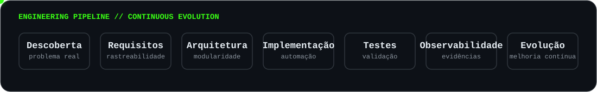

  

<h1 align="center">Matheus Amaro</h1>
<h3 align="center">Técnico de Manutenção • Estudante de ADS • Linux • Automação • Desenvolvimento de Software</h3>

  

  
  
  

---

## 👨‍💻 Perfil profissional

Atuo em **manutenção e tecnologia para sistemas de missão crítica**, com experiência em infraestrutura de servidores, virtualização, redes, diagnóstico de falhas e suporte a ambientes ferroviários.

Curso **Análise e Desenvolvimento de Sistemas** e direciono minha evolução para a interseção entre **infraestrutura, automação e desenvolvimento de software**. Nos meus projetos, procuro transformar problemas reais em soluções rastreáveis, seguras, documentadas e orientadas por evidências.

> **Princípio de engenharia:** entender o problema antes de automatizar a solução.

---

## ⚙️ Stack tecnológica

<table>
<tr>
<td valign="top" width="33%">

### 🖥️ Sistemas & Infraestrutura

</td>
<td valign="top" width="33%">

### 💻 Desenvolvimento & Automação

</td>
<td valign="top" width="33%">

### 📊 Dados & Observabilidade

</td>
</tr>
</table>

### 🧪 Em desenvolvimento acadêmico e projetos

---

## 🧭 Engenharia aplicada aos projetos

  

`Discovery` → `Requisitos` → `Arquitetura` → `Implementação` → `Testes` → `Observabilidade` → `Evolução`

Priorizo **segurança operacional, modularidade, legibilidade, documentação, versionamento e validação baseada em evidências**.

---

## 🚀 Projetos em destaque

<table>
<tr>
<td width="50%" valign="top">

### 🟢 Nexus Monitor Enterprise

**Plataforma modular para monitoramento e representação de infraestruturas críticas.**

- Dashboards operacionais
- Monitoramento de servidores e aplicações
- Virtualização e infraestrutura
- Histórico e indicadores
- Arquitetura modular
- Operação somente leitura
- Showcase público com dados fictícios

**Stack:** `Linux` `Shell Script` `HTML` `CSS` `JavaScript` `JSON` `CSV` `Git`

[**→ Explorar projeto**](https://github.com/matheusamaro-dev/nexus-monitor-enterprise-showcase)

</td>
<td width="50%" valign="top">

### 🩺 Linux Server Health Check

**Diagnóstico rápido e seguro de servidores Linux em Shell Script.**

- CPU, memória, disco e carga
- Rede e conectividade
- Serviços com falha
- Classificação de saúde
- Modo somente leitura
- Roadmap de exportação CSV/JSON

**Stack:** `Bash` `Linux` `awk` `grep` `sed` `systemd` `Git`

[**→ Explorar projeto**](https://github.com/matheusamaro-dev/linux-server-health-check)

</td>
</tr>
</table>

### 💰 Nexus Finance — laboratório de desenvolvimento mobile

Aplicação financeira em evolução utilizada como ambiente de aprendizado em **Flutter/Dart**, arquitetura de aplicação e organização de produto.

[**→ Acompanhar evolução**](https://github.com/matheusamaro-dev/nexus-finance)

---

## 📊 GitHub Intelligence

  
  

  

### 🐍 Atividade de contribuições

<picture>
  <source media="(prefers-color-scheme: dark)" srcset="./assets/contributions/github-contribution-grid-snake-dark.svg">
  <source media="(prefers-color-scheme: light)" srcset="./assets/contributions/github-contribution-grid-snake.svg">
  
</picture>

> A animação acima é atualizada automaticamente por **GitHub Actions**.

---

## 📚 Radar de aprendizado

- Análise e Desenvolvimento de Sistemas
- Desenvolvimento Web
- Engenharia de Software e Requisitos
- Arquitetura de Software
- Linux e Shell Script
- Redes de Computadores
- Segurança de Sistemas
- Monitoramento e Observabilidade
- Flutter e Dart

---

## 🎯 Direção profissional

Evoluir na integração entre **infraestrutura crítica, automação e desenvolvimento de software**, contribuindo para soluções em que **confiabilidade, segurança, observabilidade e rastreabilidade** sejam requisitos de engenharia — não apenas funcionalidades adicionais.

---

## 🤝 Conexões

  <strong>Linux • Automação • Infraestrutura • Monitoramento • Desenvolvimento de Software • Tecnologia Ferroviária</strong>

  Construindo a ponte entre operação, infraestrutura e software.

