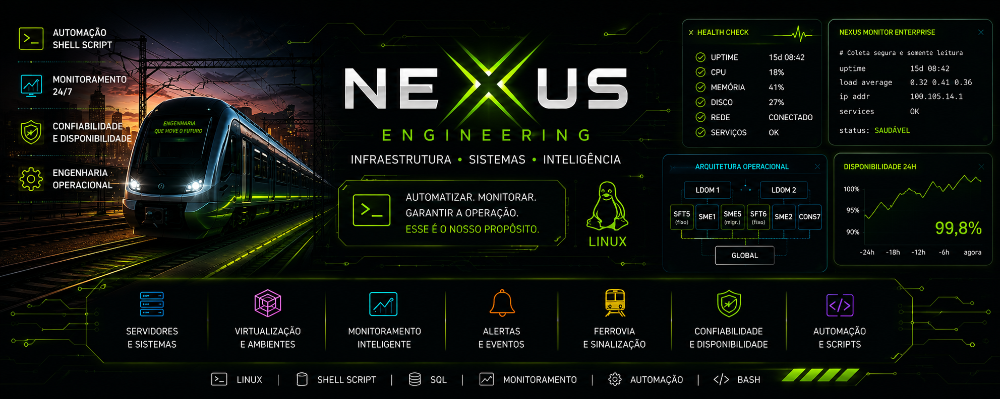

 

  

<h1 align="center">Olá, eu sou Matheus Amaro 👋</h1>

<h3 align="center">
Técnico de Manutenção | Infraestrutura Crítica | Linux | Automação
</h3>

Profissional de manutenção e tecnologia, com experiência em sistemas ferroviários, servidores, virtualização, diagnóstico de falhas e desenvolvimento de soluções para monitoramento.

  

  

## 👨‍💻 Sobre mim

Sou **Técnico de Manutenção – Sinalização**, com atuação em manutenção preventiva e corretiva de sistemas de missão crítica, infraestrutura de servidores e ambientes operacionais ferroviários.

Minha experiência reúne conhecimentos de **manutenção eletroeletrônica**, **Linux**, **Oracle Solaris**, **redes**, **virtualização**, análise de falhas e automação de rotinas.

Atualmente curso **Análise e Desenvolvimento de Sistemas**, buscando integrar minha experiência de campo ao desenvolvimento de soluções tecnológicas confiáveis, seguras e documentadas.

---

## 🚀 Projeto principal

### [Nexus Monitor Enterprise](https://github.com/matheusamaro-dev/nexus-monitor-enterprise-showcase)

[🔎 Conheça a apresentação pública do projeto](https://github.com/matheusamaro-dev/nexus-monitor-enterprise-showcase)

O **Nexus Monitor Enterprise** é uma plataforma de engenharia desenvolvida para monitoramento, documentação e representação de infraestruturas críticas.

O projeto nasceu a partir de necessidades operacionais reais, com foco em:

- Monitoramento de servidores e aplicações
- Visualização da infraestrutura
- Coleta e organização de indicadores
- Histórico de eventos e alterações
- Identificação de falhas
- Dashboards operacionais
- Segurança em modo somente leitura
- Informações baseadas em evidências

### Tecnologias do projeto

`Linux` `Shell Script` `HTML` `CSS` `JavaScript` `JSON` `CSV` `Git`

> Monitorar é informar. Entender é antecipar. Evoluir é nunca parar.

---

## 🛠️ Conhecimentos técnicos

### Sistemas e infraestrutura

- Linux e Red Hat Enterprise Linux
- Oracle Solaris
- Oracle VM for SPARC
- LDOMs e Solaris Zones
- SSH e administração remota
- Redes de computadores
- Análise de logs e processos
- Monitoramento de servidores
- Diagnóstico de falhas

### Desenvolvimento e automação

- Shell Script
- HTML
- CSS
- JavaScript
- Git e GitHub
- JSON e CSV
- Automação de rotinas
- Dashboards operacionais
- Documentação técnica

### Manutenção

- Manutenção preventiva e corretiva
- Sistemas de sinalização ferroviária
- Infraestrutura eletroeletrônica
- Sistemas de missão crítica
- Elaboração de relatórios técnicos
- Análise e tratamento de falhas
- SAP PM

---

## 📚 Atualmente estudando

- Análise e Desenvolvimento de Sistemas
- Desenvolvimento web
- Arquitetura de software
- Shell Script
- Redes de computadores
- Segurança de sistemas
- Monitoramento de infraestrutura
- Engenharia de requisitos

---

## 🎯 Objetivo profissional

Continuar evoluindo na integração entre **manutenção**, **infraestrutura** e **desenvolvimento de software**, contribuindo para a segurança, disponibilidade e confiabilidade de ambientes críticos.

---

## 🤝 Conexões profissionais

Estou aberto a conexões profissionais, colaboração em projetos e troca de conhecimentos sobre:

`Linux` `Automação` `Infraestrutura` `Monitoramento` `Manutenção` `Tecnologia Ferroviária`
